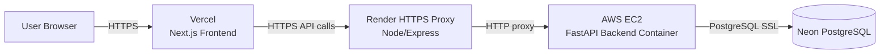
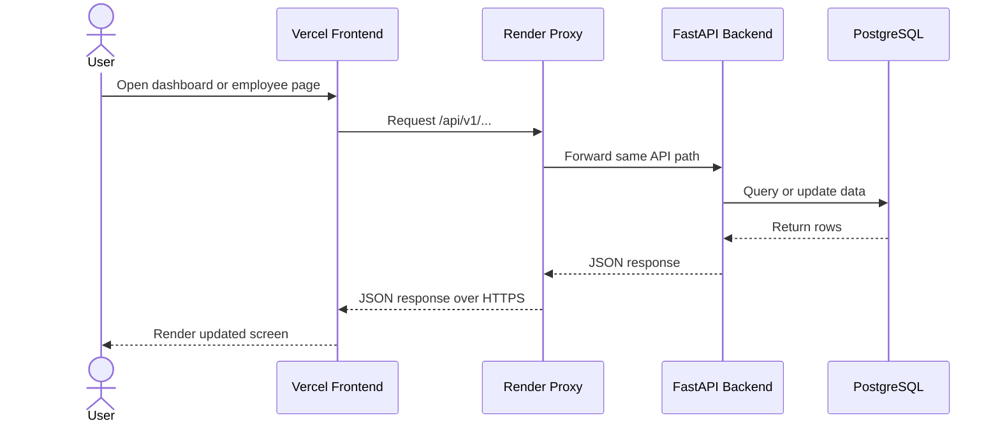
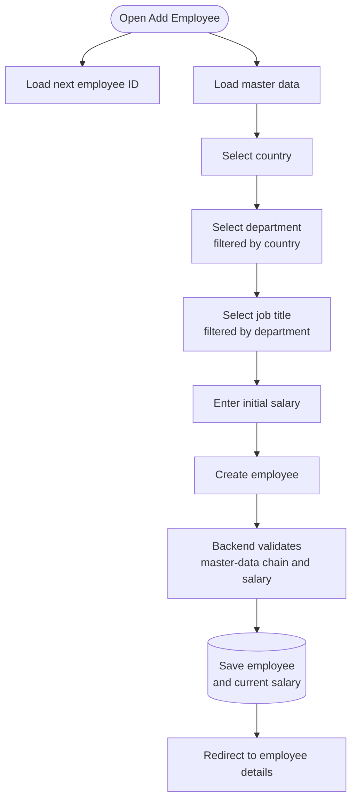
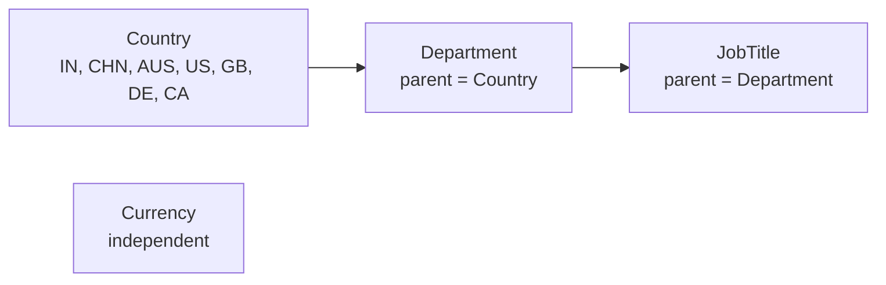
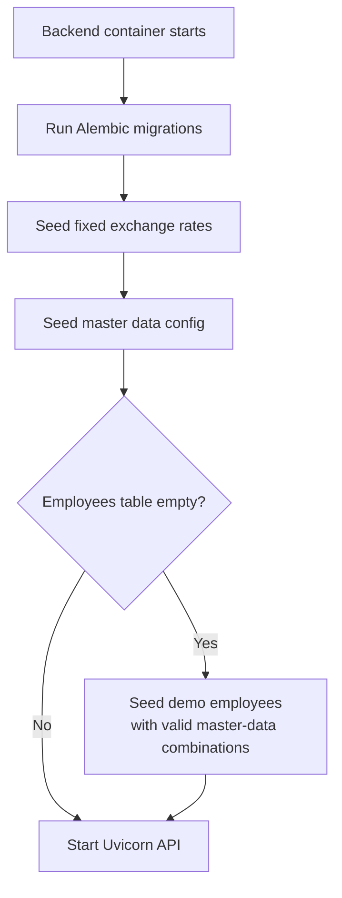
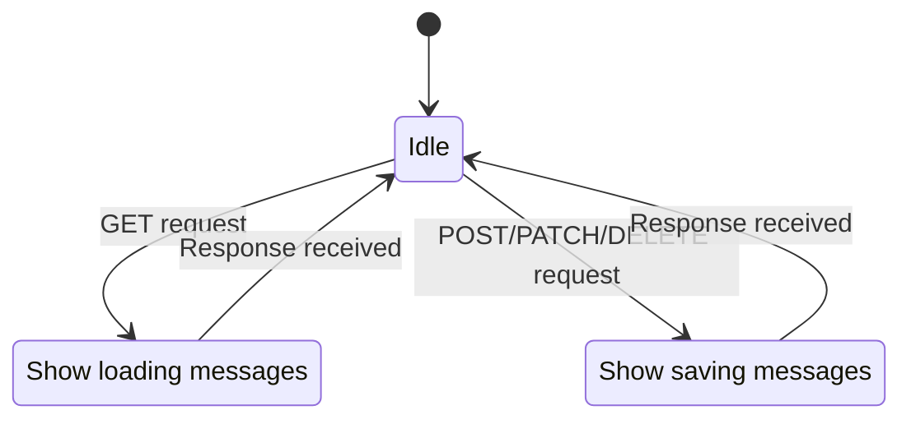

# System Diagrams

This page explains the Salary Management system with high-level diagrams.

## Deployment Flow

The browser talks only to HTTPS services. The Render proxy is used because the backend currently
runs on EC2 over HTTP, and browsers block HTTPS frontend pages from calling HTTP APIs directly.

## Application Request Flow

## Employee Create Flow

Department stays locked until a country is selected. Job title stays locked until a department is
selected, so invalid country-department-title combinations are prevented before the request reaches
the backend.

## Master Data Dependency

Master data is stored in `master_data_config`. Department rows reference a country through
`parent_code`, and job-title rows reference a department through `parent_code`. Currency has no
parent because payments can be made in any configured country currency.

## Backend Startup Flow

The bootstrap seed is safe for repeated container starts. It always ensures fixed reference data is
present, but it creates demo employees only when the employee table is empty.

## Frontend Loading Flow

The global loader listens to active API requests. Read requests show loading messages, while create,
update, and delete requests show saving messages.
